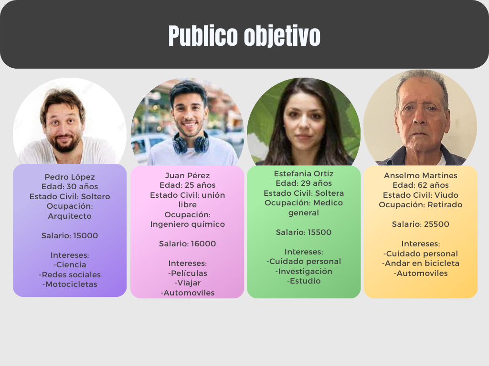
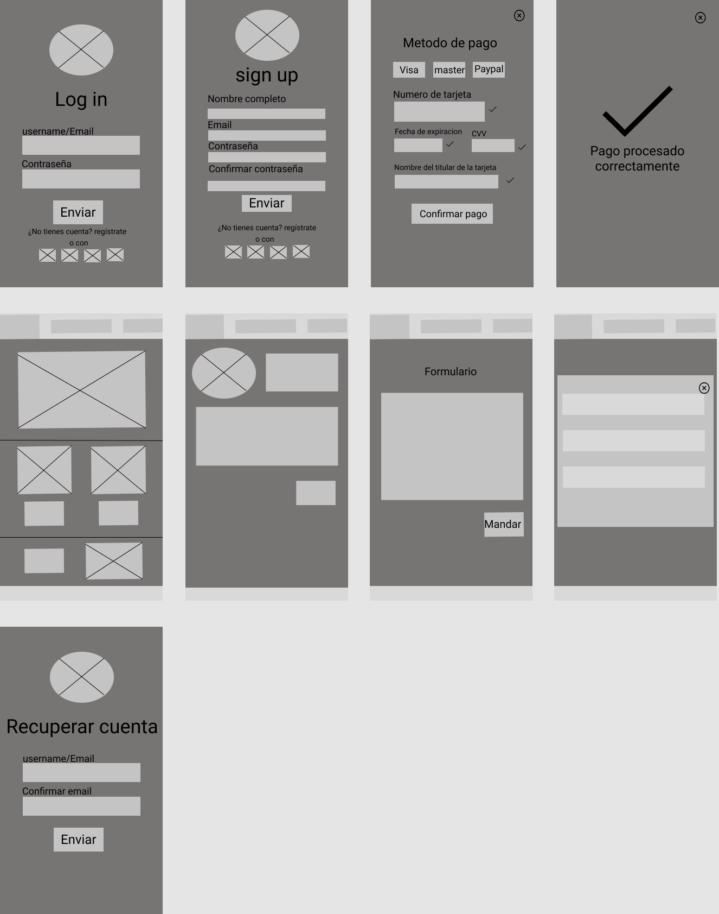

# Practica de intro

## **1. Toma de requerimientos.**

Este es el ejemplo de una toma de requerimientos del proyecto sobre una página web

En este documento se verá la realización de una práctica con la descripción siguiente:

-   Es un despacho de abogados que quiere automatizar las demandas de sus clientes, esto lo harán a traves de una página web llenando un formulario.
-   Al momento de llenar el formulario se manda al proceso de pago para finalizar la transacción.
-   Para dar seguimiento a su demanda, el cliente crea una cuenta en la plataforma y verá el seguimiento de cada una de las actualizaciones del proceso legal.
-   El administrador del sitio recibe la notificación de una nueva demanda y con los datos llenados del formulario se crea automáticamente el documento legal en formato word para empezar el proceso.
-   El administrador recibe el pago y debe de ser capaz de verlo en un dashboard para ver la cantidad de ingresos recibidos.
-   El administrador actualiza el proceso de la demanda y agrega comentarios en cada paso del proceso.
-   Al usuario le llegan correos de notificación para saber el avance de su proceso.
-   La página debe de ser responsive para poderla ver desde el celular.
-   La preferencia de colores del cliente es azul marino y blanco, pero acepta propuestas.

EL primer documento realizado es un word con los datos recabados

([Documento](./1.-Requerimientos1.doc))

## **2. Buyer persona.**

Después se realizó el buyer persona donde se muestra el cliente objetivo de este proyecto

## **3. Publico objetivo.**

A continuación se demuestra el público objetivo para el proyecto

## **4. UX.**

Este wireframe se ha realizado en Figma. Se basó en la toma de requerimientos previa

Este consta de 9 páginas las cuales cumplen con lo necesario para el correcto funcionamiento

-Inicio sesión

-Crear cuenta

-Pagar

-Payment

-Inicio

-Perfil usuario

-Formulario

-Proceso demanda

-Recuperar contraseña

## **5. UI.**

Una parte del diseño del UI ya esta completada(Diseño para Movil). que fuel el principal requerimiento del cliente. y el diseño es el siguiente
.png>)

El diseño completo de la UI esta en el siguiente link, con los diseños para computadora y tablet

([Documento](<https://www.figma.com/file/ILSNjWZRiat3Vk9jds1CZI/low-fidelity-ux-(Community)>))
